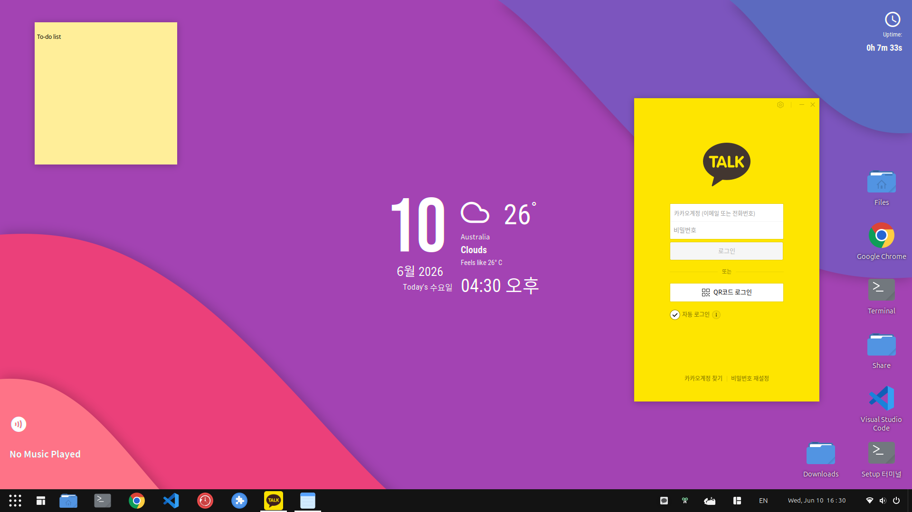

# Ubuntu 24.04 Setup

데스크탑(우분투 메인) 새로 설치 후, 개발 환경 + 한글 + Orchis 테마를 한 번에 구성하는 스크립트 모음.



<sub>Orchis 테마 · Conky 위젯(한글 날짜·날씨·업타임·음악) · xpad 메모 · 바탕화면 바로가기 · 카카오톡(한글) · Dash to Panel</sub>

`install.sh`가 `scripts/` 안의 모듈들을 순서대로 실행하고, 마지막에 데스크탑 테마 스크립트(`ubuntu_orchis_setup.sh`)를 호출합니다.

저장소: <https://github.com/seihoon0111/ubuntu_24.04_setup>

---

## ⚠️ 실행 전 꼭 읽기

- **`sudo`로 실행하지 마세요.** 일반 사용자로 실행해야 `$HOME`의 설정이 본인 소유로 만들어집니다. 스크립트가 필요한 곳에서만 내부적으로 `sudo`를 호출합니다. (root로 실행하면 자동 종료됨)
- 본인 계정이 **sudo 권한**을 가지고 있어야 합니다 (우분투 설치 시 만든 첫 계정은 기본 포함).
- 대상 OS: **Ubuntu 24.04**, GNOME 데스크탑.

---

## 준비

1. 데스크탑(우분투)에서 저장소를 클론합니다:
   ```bash
   sudo apt install -y git    # git이 없으면
   git clone https://github.com/seihoon0111/ubuntu_24.04_setup.git
   cd ubuntu_24.04_setup
   ```
2. `theme/` 폴더에 번들 zip들이 들어있는지 확인합니다 (`fonts`, `wallpapers`, `conky-config`, `fishomp-config`, `ubuntu-desktop-settings`). GTK 테마(**Orchis**)와 아이콘(**Tela**)은 번들이 아니라 **공식 GitHub 저장소에서 현재 GNOME 버전에 맞춰 빌드**해서 설치합니다.
3. (선택) 카카오톡을 설치하려면 **공식 사이트**에서 설치 파일을 받아 `~/Downloads`에 둡니다.
   - 공식: <https://www.kakao.com/talk> (kakaocorp.com으로 리다이렉트 — 정상)
   - ⚠️ `pc-kakaocorp.com`, `win-kakaocorp.com` 같은 하이픈 붙은 도메인은 **가짜**입니다.

---

## 실행

```bash
# 1) 클론 (이미 했다면 생략)
git clone https://github.com/seihoon0111/ubuntu_24.04_setup.git
cd ubuntu_24.04_setup

# 2) 실행 권한 부여 + 실행 (sudo 붙이지 않음!)
chmod +x install.sh scripts/*.sh ubuntu_orchis_setup.sh
./install.sh
```

> 기본적으로 **각 단계 실행 전에 `Run '<모듈>'? [Y/n]`** 을 물어봅니다 (Enter = 실행, `n` = 건너뜀).
> 그래서 처음부터 쭉 가지 않고 원하는 단계만 골라서 진행할 수 있습니다.
> 묻지 않고 전부 실행하려면 `--yes`.

확인 프롬프트 없이 진행:
```bash
./install.sh --yes
```

특정 단계만 빼기 (예: Docker 제외):
```bash
./install.sh --skip-docker
```

모듈 하나만 단독 실행:
```bash
bash scripts/30-docker.sh
```

도움말:
```bash
./install.sh --help
```

---

## 설치되는 것 (모듈 순서)

| 순서 | 모듈 | 내용 |
|---|---|---|
| 1 | `00-base.sh` | 시스템 업데이트 + 기본 패키지 (build-essential, git, curl, wget, **rsync**, net-tools 등) |
| 2 | `05-locale.sh` | locale: **영어 UI/폴더 + 한국 지역형식**(날짜·통화·A4). 한글 입력은 별개 |
| 3 | `10-cli.sh` | CLI 도구: ripgrep, fd, bat, fzf, jq, tmux, neovim, btop, **ffmpeg** 등 |
| 4 | `20-python.sh` | Python: python3, pipx, **pyenv** (bash/fish init 등록) |
| 5 | `30-docker.sh` | Docker Engine + Compose (+ docker 그룹 추가) |
| 6 | `35-samba.sh` | Samba 파일 공유 (`~/Share`, 읽기/쓰기, 사용자 인증) — 윈도우용 |
| 7 | `36-ssh.sh` | OpenSSH 서버 (VS Code Remote-SSH / rsync 접근용) |
| 8 | `40-gui.sh` | VS Code, Google Chrome(최신), celluloid, timeshift, ubuntu-restricted-extras |
| 9 | `50-nvidia.sh` | NVIDIA 드라이버 (GPU 감지 시에만) |
| 10 | `70-claude-code.sh` | Claude Code (공식 네이티브 인스톨러, Node 불필요) |
| 11 | (git) | git user.name/email 설정 (미설정 + 비-`--yes`일 때만 질문) |
| 12 | 테마 | `ubuntu_orchis_setup.sh` — **공식 Orchis**(GitHub 빌드, shell 테마는 User Themes 확장) + **Tela 아이콘**(GitHub) + 폰트/배경 + 우분투 dock(바텀·양쪽 모니터·둥근, Orchis 스타일) + **터미널**(fish+oh-my-posh+프로파일) + **Conky**(한글/일본어 CJK 폰트) |
| 13 | `60-korean.sh` | 한글 입력(ibus-hangul) + 오른쪽 Alt→한/영 + **한글만 Nanum 폰트** (fontconfig 폴백, 영어 UI 폰트는 그대로 유지) |
| 14 | `80-copyq.sh` | CopyQ 클립보드 매니저 + Super+V 단축키 |
| 15 | `85-xpad.sh` | **Xpad** 포스트잇 메모 (hamonikr 포크, 소스 빌드 → `/usr/local`) |
| 16 | `90-kakaotalk.sh` | **(맨 마지막)** WineHQ stable + 한글/이모지(Winemoji) 폰트 / `~/Downloads`의 KakaoTalk*.exe 있으면 GUI 설치 |

> 바탕화면 바로가기는 설치 단계가 아니라 **`update.sh`(루트)** 로 따로 관리합니다 — 아래 "바탕화면 바로가기 관리" 참고.

> - 한글 입력/CopyQ를 **테마 이후**에 두는 관례는 유지합니다. (테마는 이제 dconf의 **터미널 섹션만** import하므로 입력소스·단축키를 덮어쓰지 않지만, 순서는 안전상 그대로 둡니다.)
> - 카카오톡을 **맨 마지막**에 두는 이유: GUI 설치창 클릭이 필요하므로, 자동 단계를 모두 끝낸 뒤 마지막에 진행.

---

## 옵션 (플래그)

| 플래그 | 설명 |
|---|---|
| `--yes` | 단계별 질문 없이 전부 실행 (기본은 단계마다 `[Y/n]` 질문) |
| `--skip-locale` / `--skip-cli` / `--skip-python` / `--skip-docker` | 해당 단계 제외 |
| `--skip-dev` | Python + Docker 둘 다 제외 |
| `--skip-samba` / `--skip-ssh` / `--skip-gui` / `--skip-kakao` | 해당 단계 제외 |
| `--skip-nvidia` / `--skip-korean` / `--skip-claude` / `--skip-copyq` | 해당 단계 제외 |
| `--skip-xpad` | Xpad 설치 제외 |
| `--skip-theme` | 테마 스크립트 제외 |
| `--remove-snap` | Snap/snapd **제거** (기본은 유지) |
| `--no-fish` | 로그인 셸 fish 변경 **안 함** (기본은 변경) |
| `--` | 이 뒤의 인자는 테마 스크립트로 그대로 전달 |

> **기본 동작**: 로그인 셸을 fish로 변경은 **기본 ON**, Snap 제거는 **기본 OFF**(opt-in)입니다.
> Snap 제거는 snap Firefox를 대체재 없이 지우고 Timeshift와 충돌할 수 있어, 원할 때만 `--remove-snap` 으로 켜세요.

---

## 설치 중 사람이 개입해야 하는 부분

- **Samba 비밀번호**: 일반 실행 시 `smbpasswd` 비밀번호를 묻습니다. `--yes`면 건너뛰고 나중에 `sudo smbpasswd -a $USER` 안내.
- **git 사용자 정보**: 미설정이고 `--yes`가 아니면 이름/이메일을 물어봅니다.
- **카카오톡 설치창**: `~/Downloads`에 exe가 있으면 Wine GUI 설치창이 뜹니다. **클릭해서 진행** → 창을 닫으면 다음 단계로 자동 진행 (`--yes` 무인 실행이어도 이 단계는 클릭 필요).

---

## 설치 후 할 일

1. **로그아웃 후 재로그인 (또는 재부팅)** — 다음이 적용됩니다:
   - fish 기본 셸, docker 그룹, locale, NVIDIA 드라이버, 테마/폰트, 한글 입력
2. **한글 입력 확인**: 오른쪽 Alt 키로 한/영 전환.
3. **Samba (윈도우에서 접속)**: 윈도우 탐색기에 `\\<데스크탑IP>\Share` → 사용자명 + Samba 비밀번호.
4. **SSH / VS Code Remote-SSH (노트북에서 접속)**:
   ```bash
   ssh <사용자>@<데스크탑IP>
   ```
   VS Code: "Remote - SSH" 확장 → `Remote-SSH: Connect to Host`.
5. **카카오톡 실행** (설치했다면):
   ```bash
   WINEPREFIX=~/.wine-kakao wine "~/.wine-kakao/drive_c/Program Files (x86)/Kakao/KakaoTalk/KakaoTalk.exe"
   # 한글 깨지면: WINEPREFIX=~/.wine-kakao winetricks -q cjkfonts
   ```
6. **날씨 위젯(Conky)**: OpenWeatherMap 도시/API 키를 수동 설정 — `~/.config/conky/Alfirk-MOD/scripts/weather-v2.0.sh`
7. **듀얼 모니터 둘째 화면 상단바**(선택): 기본은 주 모니터에만 상단바가 뜹니다. 둘째 모니터에도 원하면 설치된 **Extension Manager**에서 **Multi Monitors Add-On** 을 직접 설치하세요. (dock은 이미 양쪽에 표시됨)

---

## 선택: GNOME 확장 (Extension Manager로 수동 설치)

기본 테마/dock 외에 추가로 쓰는 GNOME 확장 목록. 테마 스크립트가 깔아둔 **Extension Manager** 앱에서 검색·설치하고 **로그아웃/로그인**하면 적용됩니다. (GNOME 46 호환 버전이 있는 것만 설치하세요.)

| 확장 | 용도 |
|---|---|
| **Tiling Shell** | 창을 화면 가장자리/존으로 드래그하면 레이아웃대로 **자동 타일링**(창 크기·위치 정렬). 레이아웃 편집·멀티모니터 지원 |
| **Dash to Panel** | 상단바 + dock을 하나의 작업표시줄로 통합 (윈도우 스타일) |
| **ArcMenu** | 윈도우식 시작 메뉴 (Dash to Panel과 짝으로 사용) |
| **Date Menu Formatter** | 패널의 날짜·시계 표시 형식 커스텀 (가로 패널에서 특히 유용) |
| **Coverflow Alt-Tab** | Alt-Tab 창 전환을 3D 커버플로우(앨범 넘기기) 스타일로 |
| **Media Progress** | 미디어 알림(음악 플레이어)에 진행바 추가 |
| **Quick Settings Audio Panel** | 빠른 설정 메뉴에 볼륨 슬라이더 + 미디어 컨트롤 추가 |
| **RunPika** | 패널에서 CPU 부하를 달리는 캐릭터 애니메이션으로 표시 (RunCat 계열) |

> **Dash to Panel + ArcMenu** 를 쓰면 우분투 기본 dock 대신 통합 패널을 쓰게 되어, 테마 스크립트의 dock 설정(바텀·양쪽·둥근)과는 별개로 동작합니다. (둘 중 한 쪽 스타일을 선택해서 사용)
> Dash to Panel은 **각 모니터에 패널을 띄우는 옵션**을 자체 제공하므로, 듀얼 모니터에서 Multi Monitors Add-On은 따로 필요 없습니다. (기본 dock/상단바만 쓰면서 둘째 모니터 상단바가 필요할 때만 Multi Monitors Add-On 설치)

---

## 터미널 환경

- **터미널 앱**: GNOME Terminal — 색/폰트 프로파일("Everforest Dark", FiraCode Nerd Font)을 dconf로 설정 (덤프 전체가 아니라 `org/gnome/terminal` 섹션만 import)
- **셸**: fish + oh-my-posh 프롬프트 (`--set-fish-shell`/`install.sh` 기본값으로 로그인 셸 변경)
- 별도 터미널 에뮬레이터는 설치하지 않습니다.

### 테마 스크립트 단독 옵션
`ubuntu_orchis_setup.sh` 는 `install.sh` 없이 단독으로도 실행됩니다 (`./ubuntu_orchis_setup.sh --set-fish-shell`). 옵션:
`--skip-conky`, `--skip-icons`, `--skip-wallpaper`, `--set-fish-shell`, `--remove-snap`, `--yes`.

---

## 바탕화면 바로가기 관리 (`update.sh`)

바탕화면 바로가기는 설치 스크립트가 아니라 루트의 **`shortcuts.txt`** 를 편집하고 **`./update.sh`** 를 실행해 관리합니다. 목록에 **있으면 생성, 빼면 제거**되어 `~/Desktop` 이 목록과 동기화됩니다. (이 스크립트가 만든 것만 추적해서 지우므로, **직접 만든 바탕화면 파일은 건드리지 않습니다**.)

`shortcuts.txt` 형식 — 한 줄에 하나, `#`·빈 줄 무시, `$HOME`/`~` 자동 펼침:
```text
app: code                                                    # 설치된 앱(.desktop 이름)
folder: Downloads=$HOME/Downloads                            # 폴더 (이름=경로)
custom: GitHub | xdg-open https://github.com | web-browser   # 이름 | 명령 | 아이콘
```

- 앱 `.desktop` 이름 찾기: `ls /usr/share/applications/ | grep -i <이름>`
- 아이콘: 시스템 아이콘 이름(`web-browser` 등) **또는** `application/` 폴더에 넣은 이미지 파일명(`mylogo.png`)

```bash
cd ~/ubuntu_24.04_setup
# shortcuts.txt 편집 후
./update.sh        # sudo 불필요
```

---

## 참고: 멀티 머신 구성

- **데스크탑 (이 스크립트 대상)**: ML 학습용. SSH 서버 + rsync + Samba 제공.
- **노트북1 (윈도우)**: 자료 작업. **Samba**로 데스크탑 `~/Share` 접근.
- **노트북2 (우분투, 휴머노이드)**: 데스크탑에서 학습한 모델을 **SSH + rsync**로 로컬에 받아 로봇 제어를 **로컬에서** 실행 (네트워크 마운트로 실행하지 않음 — 끊김/지연 방지).
  ```bash
  # 노트북2에서 (예시)
  rsync -avz <사용자>@<데스크탑IP>:~/training/models/ ~/robot/models/
  ```

---

## 문제 해결

- **"Do not run with sudo" 에러**: `sudo` 떼고 일반 사용자로 실행하세요.
- **권한 거부로 멈춤**: 계정이 sudo 그룹인지 확인 (`groups`에 `sudo` 포함).
- **상단바·dock이 기본(Orchis 미적용)**: Shell 테마는 **User Themes 확장**이 필요합니다. `gnome-shell-extensions` 설치 후 **로그아웃/재로그인**해야 셸이 인식합니다. 그다음 `gnome-extensions enable user-theme@gnome-shell-extensions.gcampax.github.com` → `gsettings set org.gnome.shell.extensions.user-theme name 'Orchis-Dark'` → 다시 로그아웃/로그인.
- **Conky가 안 보임**: 로그인 직후 자동시작됩니다(재부팅 권장). 그래도 안 뜨면 `bash ~/.config/conky/Alfirk-MOD/start.sh` 로 수동 실행해 에러를 확인하세요.
- **특정 모듈만 다시**: `bash scripts/<모듈>.sh` 로 단독 재실행 (대부분 재실행 안전).
- **gsettings 관련 경고**: GNOME 세션 밖(TTY/SSH)에서 실행하면 입력/폰트/단축키 설정은 건너뜁니다 — GNOME 데스크탑에서 실행하세요.
